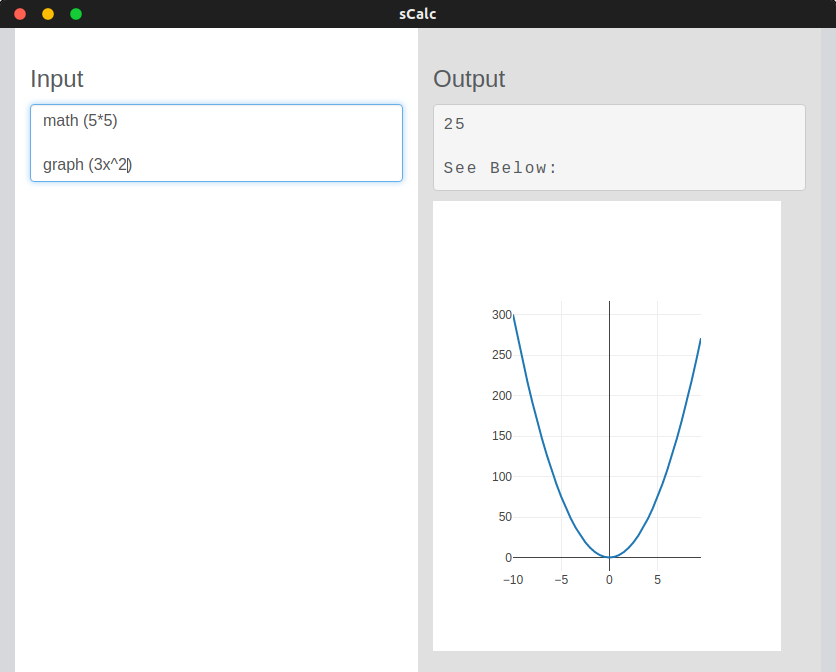

# sCalc

## Information
A robust desktop calculator created with Electron

Similar to [NaSC](https://github.com/parnold-x/nasc) | [Electron](https://github.com/electron/electron) application - cross platform

## Running it
Download repo, move into the `src` directory (`testSRC` if you want a more "beta" version), install npm dependencies using `npm install --save-dev electron` then run using `npm start`. Only tested using Ubuntu 18.04 so far.

Alternatively, you can download the release build for your system located within the `release-builds` folder. Just note that these versions are untested and not up to date, and therefore may not work properly and will not have all available features/fixes.

To build the latest version yourself, take a look at `compileInfo.md`.

If you really want to, you can also open `index.html` within `src` using a browser (only Chrome tested so far) and all functionality should work perfectly fine.

## Using it
Commands must be entered by in the following fashion: `keyword (command)` where `keyword` is a phrase listed below, and command is a valid command for the given keyword. Note the space between the keyword and opening parenthesis  - this is currently necessary for the program function correctly.

If the program doesn't understand a command, it mirrors whatever you've typed.

#### Math command
'Example: math (5*5)`

Allows for input of basic arithmetic (ie. +, -, *, /, etc.), unit conversion (ie. 16kg to lbs), and allows the use of constants (ie. pi, e, etc.).

#### Parse command
`Example: parse(a=10)`

Currently not supported, may come in the future - will bring things such as equations (ie. f(x) = 2x, what is f(2)?), variable support, complex numbers, and more.

#### Graph command
`Example: graph (3x^2)`

Only supports one graph per instance - updates to use equation closest to the bottom of the input. Interactive, but takes up a lot of unnecessary space - needs to be fixed.

Errors also appear if closing parenthesis appears before finishing equation (ie. + without a following digit/variable, incorrect amount of closing parenthesis, etc.)

## Preview

 

Currently very basic - needs a lot of work

Change the css - different theme (eventually a theme selector?)

## Future improvements
Take a look at `TODO.md`. It gives some details as to what's next and how it's going to be achieved.

## Contact
Hassan Farooq, 2018

1hassanfarooq@gmail.com

Ideas and improvements can be suggested by opening up a [new issue](https://github.com/s-hfarooq/sCalc/issues/new)
