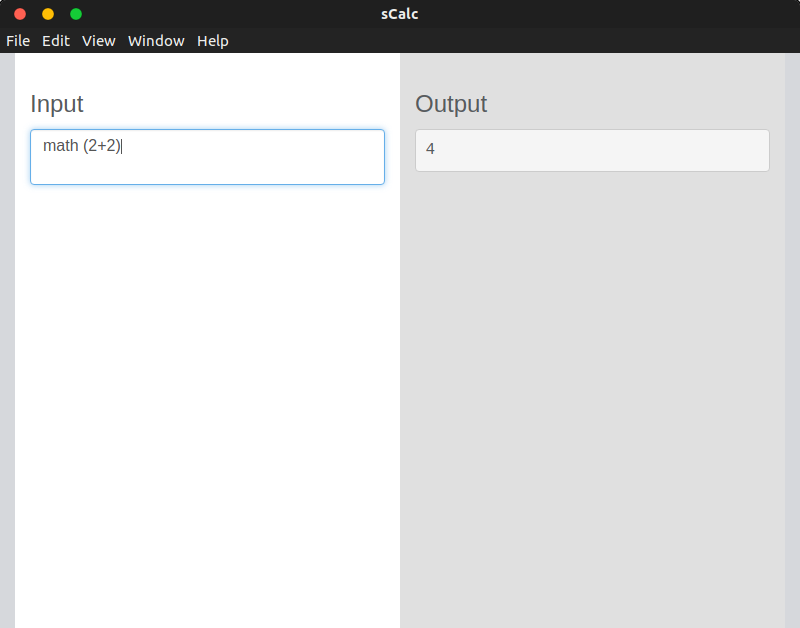

# sCalc

## Information
Similar to [NaSC](https://github.com/parnold-x/nasc)

[Electron](https://github.com/electron/electron) application - cross platform

Specific syntax (ie. graph y=x^2 would show a graph to the right of y=x^2, while zeros y=x^2 would output the zeros) eventually

# Running it
Download repo, move into `src`, run `npm install electron` if needed (probably not) then run using `npm start`. Executable applications for Windows, MacOS, and Linux will eventually exist.

You can also download the release build for your system located within `release-builds`. Just note that these versions are untested, and therefore may not work properly.  

# Using it
Currently only supports one command - `math (your input)`
A space must be present between `math` and `(` for the program to work properly (will be fixed eventually)

Supports basic arithmetic, along with unit conversion and other basic tasks. Uses `math.js`, so anything that can accomplish can also probably be done here.

Also, the math command can only currently be done on the first line - this will eventually be fixed.

If the program doesn't understand a command it mirrors whatever you've typed.

# Current look

 

Currently very basic - needs a lot of work

Change the css - differnt theme (eventually a theme selector?)

# Order of things to be completed
1. GUI - make it look better - also needs line numbers on input/output
2. Simple calculator (+, -, *, /, etc.)
3. Graph equations - interactive like Desmos? - basic graph in program with link to Desmos below
4. Improvements on math commands
5. Improvements on GUI/tweaking small things - different text color/highlights for different "objects", theming options, etc.
6. Move onto other subjects (physics, chemistry, etc.)
