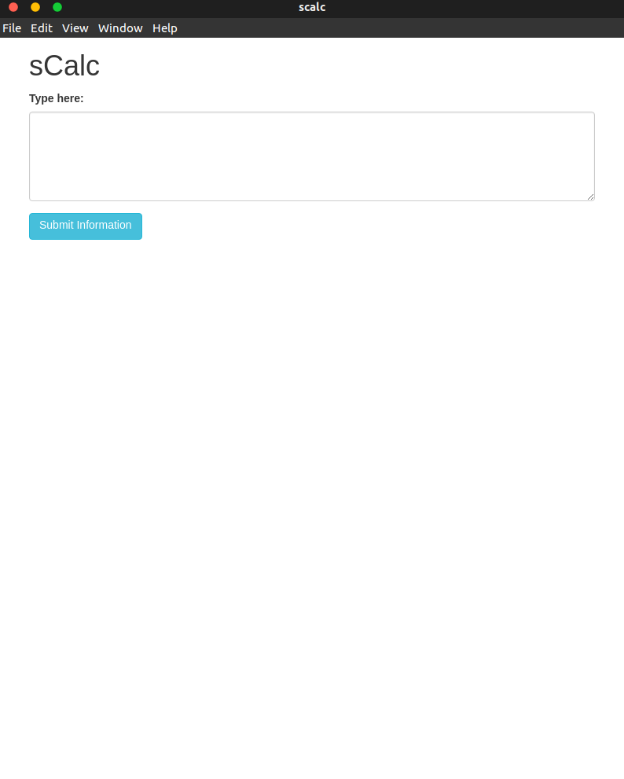

# sCalc

## Information
Similar to [NaSC](https://github.com/parnold-x/nasc)

Electron application - cross platform

Specific syntax (ie. graph y=x^2 would show a graph to the right of y=x^2, while zeros y=x^2 would output the zeros) eventually

# Running it
Download repo, run `npm install electron` if needed (probably not) then run using `npm start`. Executable applications for Windows, MacOS, and Linux will eventually exist.

# Current look

 

Currently very basic - needs a lot of work

Change the css - differnt theme (eventually a theme selector?)

# Order of things to be completed
1. GUI - make it look decent and somehow get input from user and display some result
2. Simple calculator (+, -, *, /, etc.)
3. Graph equations - interactive like Desmos?
4. Improvements on math commands
5. Improvements on GUI/tweaking small things - diffrent text color/highlights for different "objects"
6. Move onto other subjects (physics, chemistry, etc.)

Use Wolfram Alpa or Desmos?
